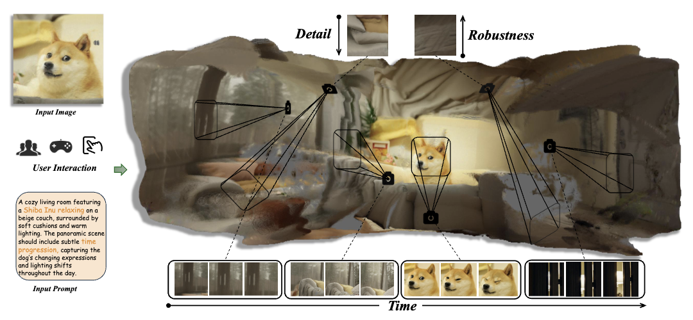
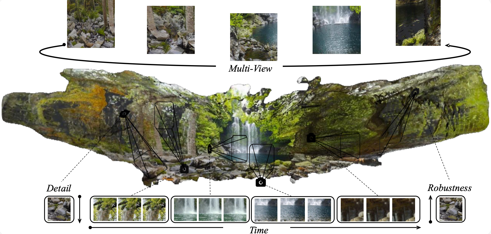

# 3D4D: An Interactive, Editable, 4D World Model via 3D Video Generation

**Yunhong He<sup>\*</sup><sup>†</sup>, Zhengqing Yuan<sup>2,\*</sup>, Zhengzhong Tu<sup>3</sup>, Yanfang Ye<sup>2</sup>, Lichao Sun<sup>1</sup>**

<sup>1</sup>Lehigh University, <sup>2</sup>University of Notre Dame, <sup>3</sup>Texas A&M University  

\* Equal contribution  
† Yunhong He is an independent undergraduate student, remotely working with Lichao Sun.


## Project Workflow



## Usage

Follow these steps to run the entire pipeline:

### 1. Clone the Repository

```bash
cd LucidDreamer-Gaussian
```

### 2. Install Environment

Install the required Python packages:

```bash
pip install .
```

### 3. Launch Lucid Dreamer Frontend

Run the frontend app to upload and process images:

```bash
python app.py
```

- Use the interactive frontend to upload a **single image**.
- After processing, download the generated `.ply` file.

### 4. Run 4DGen Pipeline

Navigate to the `4DGen` directory and execute the pipeline:

```bash
cd ../4DGen
python complete-pipeline.py
```

This will generate a series of `.ply` files for visualization.

### 5. Visualize Results

Upload the generated `.ply` files to the online viewer:

```bash
cd ../supersplat
npm install
npm run develop
```

Navigate to ```http://localhost:3000```

## Requirements

Ensure you have Python 3.12 installed. Specific dependencies are handled during the installation step. We test that our H100 device need to run 30 mins and more.


